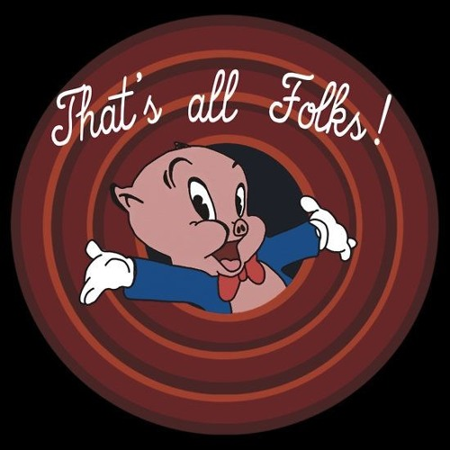

<!--
footer: Blackbird/presents: Production @ Home
paginate: true
_paginate: false
-->

# Production @ Home

AKA Dockerize All the Things

---

# Basic concepts

Simulating a production system on a single computer, for example, a Macbook Pro, is really constraining.

Docker allows building out a virtual network of computing resources, with the benefit of operating (mostly) independently of the host operating system.

Suppose we wanted to set up logical replication between Postgres databases. Configuring multiple Postgres instances _can_ be done. But it's not fun, and not interesting.

---

# Why can't we have both?

Docker let's us have our distributed system, from the convenience of our own MBP:

1. A single docker image can be used for multiple Postgres containers
2. Each container can be configured independently
3. Blowing up a container is less risky than blowing up the host operating system

---

# Here's what we're going to see

- A scripted build and run for 6 docker containers running on their network
- Logical replication between a publisher and two subscribers
- `pgbench` leveraged for "background hum" traffic
- Postgres lock activity sampled and stored in InfluxDB
- Locks data examined in InfluxDB
- Locks data examined in Grafana

Let's get started!

---

# All your build are belong to us

- Review `./restart.sh`
- Run `./restart.sh`

We now have 6 containers running on the same Docker network

# As seen by Docker Desktop

(Look at Docker Desktop)

---

# Configure the pub/sub

- Review `./replication.sh`
- Run `./replication.sh`
- Run `./scripts/test.sh`
- Check out the tables

---

# Checkout publisher and subscriber tables

Did we do that last slide? If not let's check them out.

---

# Let's generate some traffic

- `./exe/background_hum.rb &`
- `./exe/pg_sampler.rb`

---

# InfluxDB is my new favorite toy

(Check out InfluxDB)

---

# Grafana is actually my new favorite toy

(Check out Grafana)

---

# Much, much more can be done!

- Telegraf will collect container stats to display with lock activity
- Benchmarking can be randomized to induce stochastic failure
- A parallel project Dockerizing a Rails application connects to this network
- Log message shenanigans can be conducted

---

# Questions?

---

# Moar?

---

# What is a model?

(this is a quiz)

---

# Def. model

"A representation of a person or thing or of a proposed structure, typically on a smaller scale than the original."

From [Oxford Languages](https://languages.oup.com/google-dictionary-en/).

---

# Why is this important?

This talk demonstrated a _model_ of a production infrastructure.

But it's not a production infrastructure.

Referring to "models" in the context of Rails requires dealing with _polysemy_,
that is, one word ("model") with two or more related meanings.

So, what?

---

# Solving performance issues

Make a model of the poorly performing code, fix the model, apply the fix to production.

In some non-trivial sense, writing a spec is modeling desired production behavior.

---

## That's all Folks!

